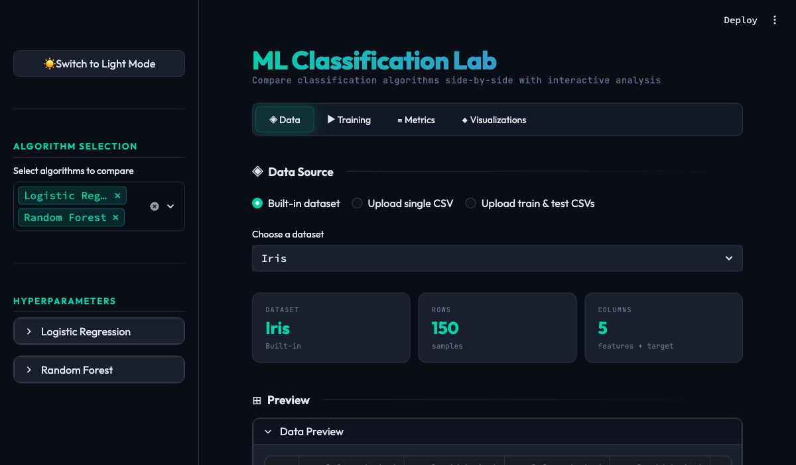

<div align="center">

# ML Classification Lab

[](https://python.org)
[](https://streamlit.io)
[](https://scikit-learn.org)
[](https://xgboost.readthedocs.io)
[](https://plotly.com)
[](LICENSE)

**Compare popular ML classification algorithms side-by-side with interactive visualizations and real-time hyperparameter tuning.**

[Report Bug](https://github.com/alfredang/mlclassification/issues) · [Request Feature](https://github.com/alfredang/mlclassification/issues)

</div>

## Screenshot



## About

ML Classification Lab is an interactive web application that enables users to compare **7 popular classification algorithms** on any dataset — built-in or uploaded. Tune hyperparameters in real time, visualize performance with Plotly charts, and export results as CSV. Features a polished dark/light theme with industrial-scientific aesthetics.

### Key Features

| Feature | Description |
|---------|-------------|
| **7 Algorithms** | Logistic Regression, SVM, Naive Bayes, Random Forest, XGBoost, KNN, Decision Tree |
| **Flexible Data** | 4 built-in datasets (Iris, Breast Cancer, Wine, Titanic), single CSV upload with split, or separate train/test CSVs |
| **Live Tuning** | Interactive hyperparameter widgets per algorithm (C, kernel, n_estimators, learning_rate, etc.) |
| **Rich Metrics** | Accuracy, Precision, Recall, F1 (macro/weighted), ROC-AUC with sortable comparison table |
| **Plotly Visualizations** | Confusion matrices, ROC curves, PR curves, feature importance, class distribution |
| **Preprocessing** | Auto missing value handling, one-hot/label encoding, StandardScaler toggle |
| **Dark/Light Theme** | Polished dark-first UI with one-click theme toggle |
| **Export** | Download metrics comparison as CSV |

## Tech Stack

| Category | Technology |
|----------|-----------|
| **Frontend** | Streamlit, Custom CSS (Outfit + JetBrains Mono fonts) |
| **Visualization** | Plotly, Matplotlib, Seaborn |
| **ML Framework** | scikit-learn, XGBoost |
| **Data** | Pandas, NumPy |
| **Package Manager** | uv |
| **Language** | Python 3.13+ |

## Architecture

```
┌─────────────────────────────────────────────────┐
│                   Streamlit UI                   │
│            (app.py + theme.py)                   │
│  ┌──────────┬──────────┬──────────┬───────────┐  │
│  │   Data   │ Training │ Metrics  │   Viz     │  │
│  │   Tab    │   Tab    │   Tab    │   Tab     │  │
│  └──────────┴──────────┴──────────┴───────────┘  │
├─────────────────────────────────────────────────┤
│              Application Layer                   │
│  ┌─────────────┐  ┌────────────┐  ┌───────────┐ │
│  │ data_loader  │  │  models    │  │   viz     │ │
│  │  .py         │  │   .py      │  │   .py     │ │
│  │             │  │            │  │           │ │
│  │ Load/Split  │  │ Build/     │  │ Plotly    │ │
│  │ Preprocess  │  │ Train/     │  │ Charts    │ │
│  │ Encode      │  │ Evaluate   │  │ Themed    │ │
│  └─────────────┘  └────────────┘  └───────────┘ │
├─────────────────────────────────────────────────┤
│           ML / Data Libraries                    │
│  scikit-learn · XGBoost · Pandas · NumPy         │
└─────────────────────────────────────────────────┘
```

## Project Structure

```
mlclassification/
├── .streamlit/
│   └── config.toml          # Streamlit theme configuration
├── sample_data/
│   └── titanic.csv           # Bundled example dataset (90 rows)
├── app.py                    # Main Streamlit entry point & tab orchestration
├── models.py                 # 7 ML algorithms, hyperparameter specs, training, evaluation
├── visualizations.py         # Themed Plotly chart functions
├── data_loader.py            # Dataset loading, preprocessing, encoding, splitting
├── theme.py                  # Dark/light theme engine, CSS injection, UI components
├── pyproject.toml            # uv-managed dependencies
├── uv.lock                   # Dependency lock file
└── .python-version           # Python 3.13
```

## Getting Started

### Prerequisites

- **Python 3.13+**
- **[uv](https://docs.astral.sh/uv/)** package manager
- **libomp** (macOS only, for XGBoost): `brew install libomp`

### Installation

```bash
# Clone the repository
git clone https://github.com/alfredang/mlclassification.git
cd mlclassification

# Install dependencies
uv sync
```

### Run

```bash
uv run streamlit run app.py
```

The app will open at **http://localhost:8501**

## Usage

1. **Data Tab** — Select a built-in dataset or upload your own CSV. Configure target/feature columns, encoding, and scaling.
2. **Training Tab** — Select algorithms from the sidebar, tune hyperparameters, and click **TRAIN MODELS**.
3. **Metrics Tab** — View the sortable comparison table with highlighted best performers. Download as CSV.
4. **Visualizations Tab** — Explore confusion matrices, ROC/PR curves, feature importance, and classification reports.

## Contributing

Contributions are welcome!

1. Fork the repository
2. Create a feature branch (`git checkout -b feature/amazing-feature`)
3. Commit your changes (`git commit -m 'Add amazing feature'`)
4. Push to the branch (`git push origin feature/amazing-feature`)
5. Open a Pull Request

## Developed By

**[Tertiary Infotech Academy Pte Ltd](https://www.tertiaryinfotech.com)**

## Acknowledgements

- [Streamlit](https://streamlit.io) — App framework
- [scikit-learn](https://scikit-learn.org) — ML algorithms and metrics
- [XGBoost](https://xgboost.readthedocs.io) — Gradient boosting
- [Plotly](https://plotly.com) — Interactive visualizations
- [uv](https://docs.astral.sh/uv/) — Fast Python package manager

---

<div align="center">

If you found this useful, please consider giving it a star!

</div>
